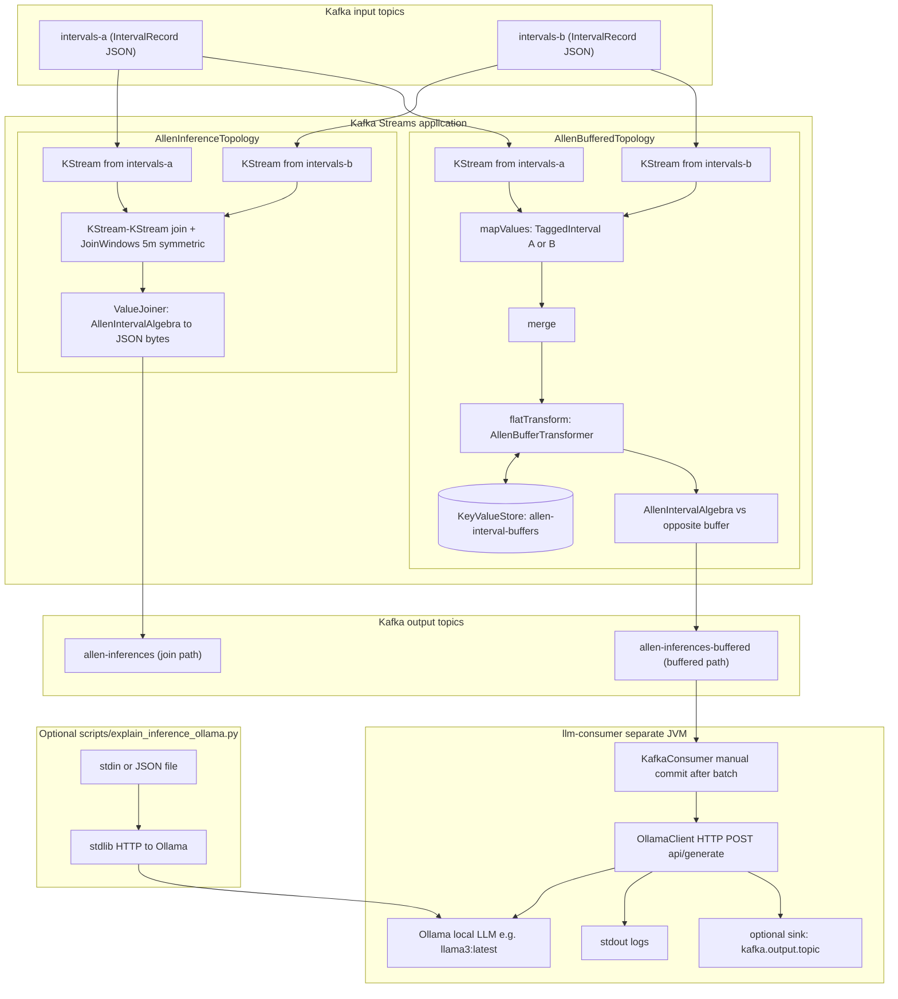
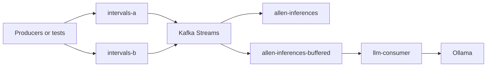

# Application topology (Kafka Streams + LLM consumer)

End-to-end view: **two interval input topics**, a **Kafka Streams** application that can run **both** inference paths (join-window and buffered—often compared in tests), **output topics** with JSON inferences, and a **separate** **`llm-consumer`** process that calls **Ollama**. Unit tests use **`TopologyTestDriver`** instead of a real cluster (no broker).

## Diagram (Mermaid)

Paste into any Mermaid-capable viewer (GitHub renders it on file view).

### Reading the diagram

| Path | What it does |
|------|----------------|
| **Join** | Pairs **A** and **B** records on the same key when **stream timestamps** fall within **`JoinWindows`**; emits exact Allen relation JSON to **`allen-inferences`**. |
| **Buffered** | Tags side A/B, **merges**, **`flatTransform`** reads/writes **`allen-interval-buffers`**, compares each arrival to the **opposite** buffer, emits 0..n JSON rows to **`allen-inferences-buffered`**. |
| **`llm-consumer`** | Consumes **`allen-inferences-buffered`** (configurable), calls **Ollama** per record batch, logs explanations; may produce an **optional** sink topic. |
| **Python script** | Same Ollama API for **ad hoc** single JSON objects (not subscribed to Kafka unless you pipe from a consumer). |

Both Streams subgraphs **read the same two input topics**. In a combined topology (for example `AllenBufferedTopologyDemoTest`) each path has its own `stream()` source nodes toward the same topic names.

## Simplified dataflow

## Related code

| Piece | Entry / constants |
|-------|-------------------|
| Join topology | `AllenInferenceTopology` — `TOPIC_A`, `TOPIC_B`, `TOPIC_OUT`, `JOIN_HALF_WIDTH` |
| Buffered topology | `AllenBufferedTopology` — `TOPIC_OUT`, `BUFFER_STORE`, `MAX_PER_SIDE` |
| Transformer | `AllenBufferTransformer` |
| Composition table | `AllenComposition` — [`docs/allen-composition.md`](allen-composition.md) |
| LLM sidecar | `llm-consumer/…/LlmInferenceConsumerApp`, `OllamaClient` |
| Smoke run | [`llm-consumer-smoke-run.md`](llm-consumer-smoke-run.md) |
